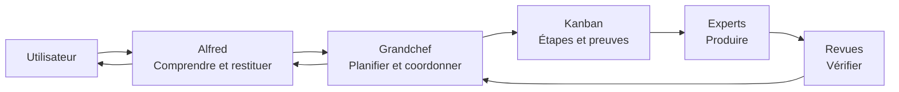

# Project Alfred

**Le collègue préféré de ton collègue préféré.**

Alfred est le point d'entrée d'une équipe d'agents spécialisés. Il comprend la demande ; un coordinateur organise le travail ; des experts produisent et vérifient les résultats. Chaque utilisateur personnalise son instance sans modifier le socle commun.

> **État : construction de la v1.** Le socle système Debian et l'installation d'Hermes verrouillé ont été exécutés sur VM ARM64. Ce dépôt contient aussi le contrat d'architecture, les modèles de rôles, les crédits, la documentation et les contrôles. L'équipe configurée et les connecteurs restent en construction. Ce n'est pas encore une distribution prête à travailler.

## Découvrir le fonctionnement

- [Le bureau d'études d'Alfred : guide illustré](docs/guide-illustre.md)
- [Socle public, instance privée : personnaliser sans tout recopier](docs/personnalisation.md)
- [Qui publie vers quels dépôts ?](docs/publication.md)
- [Construction de la v1 et critères de validation](docs/construction.md)
- [Installer le socle système et le moteur sur Debian 12 ARM64](docs/installation.md)
- [Choix des outils et étude de l’écosystème](docs/ecosysteme.md)
- [ECC, Context7, Headroom, RTK et zram : décisions et état d'installation](docs/choix-modules.md)
- [Crédits, licences et rôle des composants utilisés](THIRD_PARTY_NOTICES.md)
- [Contrat de la plateforme](config/platform-contract.json)



## Ce que fournit le socle

Des rôles génériques, une orchestration durable, des interfaces vers les outils et les canaux, des conventions de mémoire, une supervision et des procédures reproductibles. Les composants prévus ne sont considérés comme opérationnels qu'après leurs essais d'acceptation.

Le moteur retenu pour la cible est [Hermes Agent](https://github.com/NousResearch/hermes-agent). Ses versions et dépendances seront verrouillées dans le bootstrap. Les profils sont des identités persistantes exécutées à la demande ; ils ne sont pas des processus qui doivent tous rester en mémoire.

## Préparer sa propre instance

Commencer par [l'exemple de configuration](examples/instance.example.json) et les modèles de SOUL sous [profiles](profiles). Conserver sa personnalisation dans un espace privé. Utiliser ses propres comptes, documents, budgets et accès aux outils.

Le futur installateur complet composera une version précise du socle avec cette personnalisation. La préparation système Debian est disponible séparément ; l'installation de production sera publiée après son test réel sur VM vierge.

## Contribuer

Avec Python 3.11 ou supérieur, lancer depuis la racine :

```sh
python3 tools/check_repository.py
```

Un changement de configuration, rôle ou skill doit aussi expliquer ses effets dans la documentation. Ne jamais ajouter des credentials, un fichier `.env`, des sessions, des mémoires réelles ou un dossier client au socle public. Les règles sont précisées dans [AGENTS.md](AGENTS.md).

Le code original est distribué sous [licence MIT](LICENSE). Les dépendances conservent leurs licences propres.
