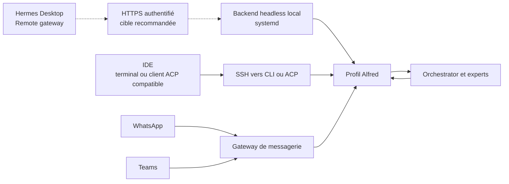

# Les portes d’entrée d’Alfred

Plusieurs portes donnent accès au même profil d’interface, Alfred. Son rôle reste de comprendre la demande et de restituer le résultat ; Orchestrator et les experts travaillent derrière lui. Les configurations de canaux, comptes, clés et identités appartiennent à l’instance privée.



Les flèches pointillées représentent l’accès HTTPS de Desktop, encore à déployer et à éprouver. Les autres accès conservent leurs essais d’acceptation propres.

Le profil et ses préférences sont communs ; les conversations de chaque canal peuvent avoir leurs propres sessions. Cette architecture ne promet pas une fusion automatique de tous les historiques. Les missions durables doivent porter le contexte utile à leur reprise.

## Connecter Hermes Desktop à la gateway

Hermes Desktop se connecte directement à l’adresse HTTPS de l’instance. Le fonctionnement visé est : **Desktop → HTTPS authentifié → backend Hermes supervisé → profil Alfred**. Le serveur reste disponible lorsque Desktop se ferme.

**État du déploiement :** le backend local est installé et testé. Sa publication HTTPS, son authentification et le renouvellement automatique du certificat restent à finaliser. La procédure suivante décrit les champs de la connexion retenue ; elle devient utilisable dès que l’endpoint HTTPS de l’instance est validé. L’adresse et le compte réels sont documentés dans le dépôt privé de chaque utilisateur.

### Ajouter la connexion

Dans **Settings → Gateways**, cliquer **Add connection**, puis choisir **Remote gateway**. Remplir le formulaire :

| Champ à l’écran | Réglage |
|---|---|
| **Name** | `Alfred`, ou un nom unique pour cette instance |
| **Gateway URL** | L’URL HTTPS de l’instance, par exemple `https://alfred.example.org` |
| **Authentication** | **Sign in**, pour la gateway avec authentification native |
| **Session token** | Aucun token à coller avec **Sign in** |
| **Extra gateway headers** | Laisser vide pour une publication HTTPS classique ; renseigner uniquement les en-têtes exigés par un éventuel proxy d’accès configuré pour cette instance |

L’exemple `alfred.example.org` doit être remplacé par le domaine de son instance. L’URL est celle de la gateway, sans chemin `/api/ws`, sans callback Teams et sans adresse de boucle locale du PC.

Après avoir renseigné l’URL, choisir **Sign in** et terminer la connexion dans la fenêtre d’authentification de la gateway. Selon le fournisseur configuré sur le serveur, cette fenêtre présente un identifiant et un mot de passe, ou une connexion OAuth. **Sign in** ne signifie donc pas obligatoirement posséder un compte Nous. Desktop conserve la session de connexion ; les identifiants restent privés.

Cliquer **Save connection**, puis **Test** sur la connexion enregistrée. Le test doit valider HTTP et WebSocket. Ensuite, sélectionner cette gateway dans **Sessions**, choisir le profil **Alfred** et envoyer une première demande pour vérifier une réponse complète. Définir la connexion comme **Primary** si elle doit devenir l’instance par défaut ; la connexion locale **This device**, gérée par Desktop, peut rester présente.

### Comprendre le formulaire

Le bouton **Session token** visible dans le formulaire correspond à un autre mode d’authentification. Pour la gateway HTTPS avec authentification native retenue ici, sélectionner **Sign in** et utiliser le fournisseur configuré côté serveur. Le token technique de l’ancien backend local n’est pas l’identifiant de cette nouvelle connexion.

Si le test échoue, distinguer une URL inaccessible ou un certificat invalide, une connexion utilisateur refusée et un WebSocket bloqué par le reverse proxy. Une réussite du test de transport doit être suivie d’une demande et d’une réponse réelles avant de déclarer Desktop opérationnel.

**Connect via SSH** reste une alternative privée, où Desktop gère le transport lui-même. Son adaptation au compte de service et au profil du harness reste à éprouver ; elle n’est pas nécessaire à la procédure Remote gateway ci-dessus.

Les étapes suivent le [guide officiel des connexions Desktop](https://github.com/NousResearch/hermes-agent/blob/f97608f178d1ffeca59860195ab7da295f7c8e5f/website/docs/user-guide/multi-connection-desktop.md) et le [formulaire officiel](https://github.com/NousResearch/hermes-agent/blob/f97608f178d1ffeca59860195ab7da295f7c8e5f/apps/desktop/src/app/settings/connections-registry.tsx), qui distingue token et connexion native, y compris par identifiant/mot de passe. Les prérequis techniques côté serveur figurent dans [l’administration du backend Desktop](desktop-serveur.md).

## WhatsApp et Teams

La gateway de messagerie du socle reçoit les messages des canaux activés et les route vers Alfred. WhatsApp utilise le bridge et la session de l’instance. Teams utilise ses propres credentials et son callback HTTPS public authentifié. Ces éléments sont configurés séparément ; la disponibilité locale du bridge ou du listener Teams ne suffit pas à déclarer un échange utilisateur réussi.

Les credentials, sessions de liaison et identités restent hors du socle public. Les probes du superviseur vérifient les canaux configurés. Chaque instance doit éprouver une demande et une réponse réelles sur chaque canal avant de le déclarer prêt.

## IDE via SSH

Un terminal d’IDE, notamment Codex ou Antigravity, peut accéder à la CLI sur la VM :

```bash
ssh -t USER@HOST 'sudo -n -u alfred /usr/local/bin/hermes -p alfred chat'
```

Une demande saisie dans cette CLI rejoint Alfred sur la VM. Le chat intégré propre à un IDE reste celui de son fournisseur : un accès SSH ne remplace pas automatiquement son agent par Alfred.

Les clients prenant en charge **ACP** peuvent utiliser le processus distant en stdio, sans allocation de TTY :

```bash
ssh -T USER@HOST 'sudo -n -u alfred /usr/local/bin/hermes -p alfred acp'
```

La commande d’accès `sudo` doit être autorisée dans les droits de l’opérateur ; ce guide n’accorde pas de sudo général à un agent. L’intégration graphique dépend des capacités du client IDE et doit être testée par client. Aucune compatibilité ACP native de tous les IDE mentionnés n’est supposée.

## Ce qui est vérifié

Sur l’instance de validation Debian 12 ARM64, le backend écoute uniquement sur 127.0.0.1, sert le contexte Alfred et répond en HTTP et WebSocket avec son token. Les accès sensibles anonymes sont rejetés. Ces contrôles portent sur le backend local et son authentification ; la publication HTTPS reste à vérifier. De même, la configuration UI du Desktop, une conversation utilisateur, les livraisons WhatsApp/Teams et chaque raccordement graphique IDE conservent leurs essais d’acceptation propres.
