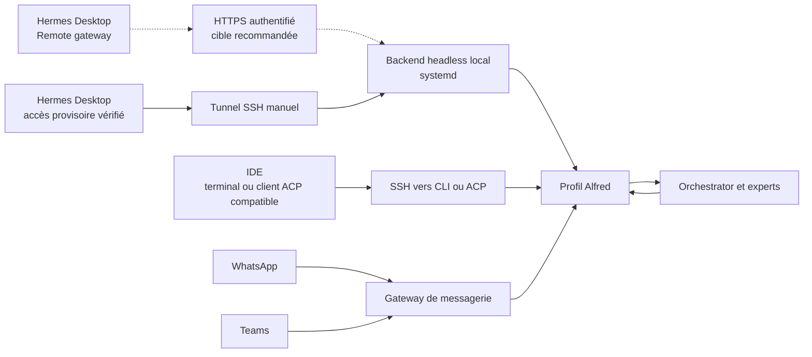

# Les portes d’entrée d’Alfred

Plusieurs portes donnent accès au même profil d’interface, Alfred. Son rôle reste de comprendre la demande et de restituer le résultat ; Orchestrator et les experts travaillent derrière lui. Les configurations de canaux, comptes, clés et identités appartiennent à l’instance privée.



Les flèches pointillées représentent la cible HTTPS, encore à déployer et à éprouver. Le transport Desktop actuellement vérifié est le tunnel SSH manuel.

Le profil et ses préférences sont communs ; les conversations de chaque canal peuvent avoir leurs propres sessions. Cette architecture ne promet pas une fusion automatique de tous les historiques. Les missions durables doivent porter le contexte utile à leur reprise.

## Hermes Desktop : accès recommandé et état actuel

Pour une instance utilisée au quotidien, le harness recommande **Remote gateway en HTTPS direct vers un backend supervisé**. Desktop se connecte à une URL stable ; l'utilisateur n'a aucun tunnel à ouvrir sur son PC. Le backend reste lancé et surveillé par systemd. Le reverse proxy TLS rejoint ce backend sur la boucle locale de la VM : « HTTPS direct » décrit l'accès du PC, pas une exposition sans protection du processus Hermes.

Ce mode exige un domaine, un certificat avec renouvellement automatique, l'authentification native Hermes et une validation HTTP et WebSocket de bout en bout. Le bootstrap actuel **ne déploie pas encore cette publication HTTPS**. Le backend à token de boucle locale décrit ci-dessous doit rester privé ; son token Desktop ne constitue pas à lui seul une configuration d'authentification publique. Le partage d'un reverse proxy avec Teams est possible, avec des noms d'hôte et routes distincts ; les méthodes d'authentification de Desktop et de Teams restent propres à chaque canal.

**Connect via SSH** est l'alternative pour une instance accessible par SSH, sans publication HTTPS. Desktop gère lui-même le transport, les probes et le token du backend. Ce mode ne limite pas l'autonomie de la gateway de messagerie ou des autres services déjà supervisés. Le service permanent n'est donc pas, à lui seul, une raison de préférer un tunnel manuel.

L'adaptation SSH native au harness reste à éprouver : le compte de connexion doit accéder au bon exécutable et au profil Alfred, sans créer un second environnement Hermes. Le compte de service sans shell et le wrapper d'accès du socle ne garantissent pas cette compatibilité automatiquement. Ne pas présenter un simple login administrateur comme une intégration Desktop validée.

**Remote gateway via tunnel SSH manuel** reste un accès provisoire vérifié et une méthode de diagnostic. Il ajoute la gestion d'un processus côté PC ; ce n'est plus l'expérience recommandée par défaut. Les procédures suivantes documentent exactement cet accès disponible aujourd'hui.

Les modes Remote gateway et SSH sont décrits dans les [sources officielles du Desktop verrouillé](https://github.com/NousResearch/hermes-agent/blob/f97608f178d1ffeca59860195ab7da295f7c8e5f/website/docs/user-guide/multi-connection-desktop.md). Le [serveur officiel](https://github.com/NousResearch/hermes-agent/blob/f97608f178d1ffeca59860195ab7da295f7c8e5f/hermes_cli/web_server.py) définit la porte d'authentification à configurer pour HTTPS.

### Sur la VM

Après installation du moteur, composition du profil Alfred et supervision, exécuter depuis le checkout public :

```bash
sudo python3 bootstrap/install-desktop.py
```

`alfred-desktop.service` lance le profil Alfred sur **127.0.0.1:9119**, avec `--isolated` pour fixer son contexte. Ce choix de contexte n’est pas une isolation de sécurité entre profils. Le token est créé aléatoirement dans `/etc/alfred/desktop.env`, root `0600`, et réutilisé lors des relances. Il ne rejoint aucun dépôt. Une reconstruction neuve crée un nouveau token à configurer côté Desktop.

Le service dispose de `Restart=always`, de limites de démarrage et d’une sonde HTTP de version dans `/etc/alfred/service-inventory.d/desktop.json`. La sonde vérifie le backend ; elle ne prouve pas la livraison d’une réponse de modèle. Les logs stdout/stderr natifs sont supprimés pour éviter d’enregistrer une URL d’authentification WebSocket. Les états systemd et les probes restent disponibles pour le diagnostic. Le plafond local est de 384 Mo ; le service partage aussi la limite de la slice runtime.

### Depuis Windows

Avec PowerShell 7 et OpenSSH, utiliser l’[assistant de tunnel](../tools/Start-AlfredTunnel.ps1) du dépôt, en fournissant ses propres chemins :

```powershell
./tools/Start-AlfredTunnel.ps1 -SshHost HOST -SshUser USER `
  -IdentityFile "CHEMIN_CLE" -KnownHostsFile "CHEMIN_KNOWN_HOSTS" `
  -CopySessionToken
```

Le fingerprint de la VM doit avoir été vérifié avant d’ajouter sa clé hôte au fichier. Le script conserve `StrictHostKeyChecking=yes` et n’accepte pas silencieusement un changement de VM. Il ouvre un processus SSH caché, limité à un port de boucle locale, avec keepalive. L’option de copie utilise l’accès administratif SSH autorisé pour lire le token ; elle n’affiche jamais sa valeur. Coller ce token uniquement dans Hermes Desktop, puis vider le presse-papiers et son éventuel historique. Ne pas le coller dans une conversation ou un fichier de configuration Git.

Dans Hermes Desktop, ajouter une connexion :

| Champ | Valeur |
|---|---|
| Type | Remote gateway |
| Nom | Alfred, ou un nom unique choisi pour cette instance |
| Gateway URL | `http://127.0.0.1:9119` |
| Authentification | Session token |
| Token | La valeur privée obtenue via SSH |

Cliquer **Test**, choisir le profil Alfred et définir la connexion comme principale si souhaité. Selon la version du Desktop, le menu s’appelle Gateway ou Gateways. L’app doit tester HTTP **et** WebSocket. Le transport est à lancer à chaque ouverture de session locale ; le backend, lui, reste supervisé. Le script renvoie son PID pour fermer le tunnel local sans arrêter Alfred. Si le port est déjà occupé, ne pas lancer une seconde copie ; vérifier le tunnel existant ou choisir `-LocalPort 19119` et adapter l’URL.

Sur Linux/macOS, le transport équivalent est :

```bash
ssh -N -o ExitOnForwardFailure=yes -o ServerAliveInterval=30 \
  -o ServerAliveCountMax=3 -L 127.0.0.1:9119:127.0.0.1:9119 USER@HOST
```

Le port 9119 n’a besoin d’aucune redirection NAT. Depuis l’extérieur, utiliser un chemin SSH accessible et vérifié. La publication HTTPS recommandée exige encore son déploiement, son authentification et ses tests ; elle n’est pas activée par ce bootstrap.

## WhatsApp et Teams

La gateway de messagerie du socle reçoit les messages des canaux activés et les route vers Alfred. WhatsApp utilise le bridge et la session de l’instance. Teams utilise ses propres credentials et son callback HTTPS public authentifié. Ces éléments sont configurés séparément ; la disponibilité locale du bridge ou du listener Teams ne suffit pas à déclarer un échange utilisateur réussi.

Les credentials, sessions de liaison et identités restent hors du socle public. Les probes du superviseur vérifient les canaux configurés. Chaque instance doit éprouver une demande et une réponse réelles sur chaque canal avant de le déclarer prêt.

## IDE via SSH

Un terminal d’IDE, notamment Codex ou Antigravity, peut accéder à la CLI sur la VM :

```bash
ssh -t USER@HOST 'sudo -n -u alfred /usr/local/bin/hermes -p alfred chat'
```

Une demande saisie dans cette CLI rejoint Alfred sur la VM. Le chat intégré propre à un IDE reste celui de son fournisseur : un accès SSH ne remplace pas automatiquement son agent par Alfred.

Les clients prenant en charge **ACP** peuvent utiliser le processus distant en stdio, sans allocation de TTY :

```bash
ssh -T USER@HOST 'sudo -n -u alfred /usr/local/bin/hermes -p alfred acp'
```

La commande d’accès `sudo` doit être autorisée dans les droits de l’opérateur ; ce guide n’accorde pas de sudo général à un agent. L’intégration graphique dépend des capacités du client IDE et doit être testée par client. Aucune compatibilité ACP native de tous les IDE mentionnés n’est supposée.

## Ce qui est vérifié

Sur l’instance de validation Debian 12 ARM64, le backend écoute uniquement sur 127.0.0.1, sert le contexte Alfred et répond en HTTP et WebSocket avec son token. Les accès sensibles anonymes sont rejetés. Le tunnel SSH depuis Windows atteint le backend. Ce sont des contrôles de transport et d’authentification ; la configuration UI du Desktop, une conversation utilisateur, les livraisons WhatsApp/Teams et chaque raccordement graphique IDE conservent leurs essais d’acceptation propres.
