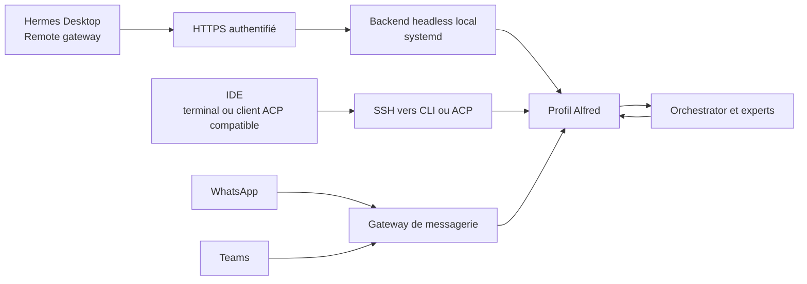

# Les portes d’entrée d’Alfred

Plusieurs portes donnent accès au même profil d’interface, Alfred. Son rôle reste de comprendre la demande et de restituer le résultat ; Orchestrator et les experts travaillent derrière lui. Les configurations de canaux, comptes, clés et identités appartiennent à l’instance privée.



Le backend HTTPS, son authentification native et le WebSocket sont vérifiés sur l’instance de validation. Les conversations utilisateur de chaque canal conservent leurs essais d’acceptation propres.

Le profil et ses préférences sont communs ; les conversations de chaque canal peuvent avoir leurs propres sessions. Cette architecture ne promet pas une fusion automatique de tous les historiques. Les missions durables doivent porter le contexte utile à leur reprise.

## Connecter Hermes Desktop à la gateway

Hermes Desktop se connecte directement à l’adresse HTTPS de l’instance. Le fonctionnement visé est : **Desktop → HTTPS authentifié → backend Hermes supervisé → profil Alfred**. Le serveur reste disponible lorsque Desktop se ferme.

**État du déploiement :** le backend HTTPS est installé et vérifié sur l’instance de validation. Le compte local par mot de passe est le fournisseur actif ; le parcours natif Desktop et le WebSocket sont testés. OAuth Nous a été étudié et sa redirection vérifiée, puis désactivé selon le choix de l’utilisateur de cette instance. Chaque installation conserve son propre choix d’authentification. Le parcours de connexion Desktop, le refus anonyme et le WebSocket authentifié sont testés. Une connexion réussie dans l’application utilisateur et une demande/réponse réelle conservent leur validation. Chaque instance choisit son domaine, son port public et son fournisseur d’authentification ; ces valeurs sont dans son dépôt privé.

### Ajouter la connexion

Dans **Settings → Gateways**, cliquer **Add connection**, puis choisir **Remote gateway**. Remplir le formulaire :

| Champ à l’écran | Réglage |
|---|---|
| **Name** | `Alfred`, ou un nom unique pour cette instance |
| **Gateway URL** | L’URL HTTPS de l’instance, par exemple `https://alfred.example.org`, ou `https://alfred.example.org:28443` si le port public est différent de 443 |
| **Authentication** | **Sign in**, pour la gateway avec authentification native |
| **Session token** | Aucun token à coller avec **Sign in** |
| **Extra gateway headers** | Laisser vide pour une publication HTTPS classique ; renseigner uniquement les en-têtes exigés par un éventuel proxy d’accès configuré pour cette instance |

L’exemple `alfred.example.org` doit être remplacé par le domaine de son instance. Si la connexion Internet impose des ports publics hauts, l’URL inclut ce port. Plusieurs domaines peuvent partager une redirection vers le même reverse proxy, qui les distingue par leur nom ; aucune seconde règle NAT n’est nécessaire uniquement pour séparer Desktop et Teams. L’URL est celle de la gateway, sans chemin `/api/ws`, sans callback Teams et sans adresse de boucle locale du PC.

Après avoir renseigné l’URL, choisir **Sign in** et terminer la connexion dans la fenêtre d’authentification de la gateway. Selon le fournisseur configuré sur le serveur, cette fenêtre présente un identifiant et un mot de passe, ou une connexion OAuth. **Sign in** ne signifie donc pas obligatoirement posséder un compte Nous. Desktop conserve la session de connexion ; les identifiants restent privés.

Cliquer **Save connection**, puis **Test** sur la connexion enregistrée. Le test doit valider HTTP et WebSocket. Ensuite, sélectionner cette gateway dans **Sessions**, choisir le profil **Alfred** et envoyer une première demande pour vérifier une réponse complète. Définir la connexion comme **Primary** si elle doit devenir l’instance par défaut ; la connexion locale **This device**, gérée par Desktop, peut rester présente. Le backend du socle utilise Alfred comme contexte par défaut. Dans Desktop, un profil choisi explicitement prend toutefois priorité : sélectionner un expert ouvre une conversation directe avec lui. Pour l’usage d’assistant, conserver **Alfred** sélectionné et lui confier la demande ; la liste des experts n’est pas un routage automatique vers Alfred.

### Comprendre le formulaire

Le bouton **Session token** visible dans le formulaire correspond à un autre mode d’authentification. Pour la gateway HTTPS avec authentification native retenue ici, sélectionner **Sign in** et utiliser le fournisseur configuré côté serveur. Le token technique de l’ancien backend local n’est pas l’identifiant de cette nouvelle connexion.

Si le test échoue, distinguer une URL inaccessible ou un certificat invalide, une connexion utilisateur refusée et un WebSocket bloqué par le reverse proxy. Une réussite du test de transport doit être suivie d’une demande et d’une réponse réelles avant de déclarer Desktop opérationnel.

**Connect via SSH** reste une alternative privée, où Desktop gère le transport lui-même. Son adaptation au compte de service et au profil du harness reste à éprouver ; elle n’est pas nécessaire à la procédure Remote gateway ci-dessus.

Les étapes suivent le [guide officiel des connexions Desktop](https://github.com/NousResearch/hermes-agent/blob/f97608f178d1ffeca59860195ab7da295f7c8e5f/website/docs/user-guide/multi-connection-desktop.md) et le [formulaire officiel](https://github.com/NousResearch/hermes-agent/blob/f97608f178d1ffeca59860195ab7da295f7c8e5f/apps/desktop/src/app/settings/connections-registry.tsx), qui distingue token et connexion native, y compris par identifiant/mot de passe. Les prérequis techniques côté serveur figurent dans [l’administration du backend Desktop](desktop-serveur.md).

## WhatsApp et Teams

La gateway de messagerie du socle reçoit les messages des canaux activés et les route vers Alfred. WhatsApp utilise le bridge et la session de l’instance. Teams utilise ses propres credentials et son callback HTTPS public authentifié. Ces éléments sont configurés séparément ; la disponibilité locale du bridge ou du listener Teams ne suffit pas à déclarer un échange utilisateur réussi.

Les credentials, sessions de liaison et identités restent hors du socle public. Les probes du superviseur vérifient les canaux configurés. Chaque instance doit éprouver une demande et une réponse réelles sur chaque canal avant de le déclarer prêt.

## IDE via SSH

Un terminal d’IDE, notamment Codex ou Antigravity, peut accéder à la CLI sur la VM :

```bash
ssh -t USER@HOST 'sudo -n -u alfred /usr/local/bin/hermes -p alfred chat'
```

Une demande saisie dans cette CLI rejoint Alfred sur la VM. Le chat intégré propre à un IDE reste celui de son fournisseur : un accès SSH ne remplace pas automatiquement son agent par Alfred.

Les clients prenant en charge **ACP** peuvent utiliser le processus distant en stdio, sans allocation de TTY :

```bash
ssh -T USER@HOST 'sudo -n -u alfred /usr/local/bin/hermes -p alfred acp'
```

La commande d’accès `sudo` doit être autorisée dans les droits de l’opérateur ; ce guide n’accorde pas de sudo général à un agent. L’intégration graphique dépend des capacités du client IDE et doit être testée par client. Aucune compatibilité ACP native de tous les IDE mentionnés n’est supposée.

## Ce qui est vérifié

Sur l’instance Debian 12 ARM64 : certificat HTTPS reconnu depuis Windows ; formulaire de connexion disponible ; sessions sensibles anonymes et mauvais mot de passe refusés ; connexion correcte acceptée ; cookies Secure ; parcours natif Desktop avec PKCE et échange de code testé ; WebSocket authentifié accepté, ticket réutilisé et accès anonyme refusés ; contexte actif Alfred confirmé. Le reverse proxy est supervisé, redémarre automatiquement et possède une sonde TLS pour chaque domaine, avec alerte avant échéance. Ces preuves de transport et d’authentification ne remplacent pas une conversation utilisateur dans Desktop ou les livraisons de messagerie.
