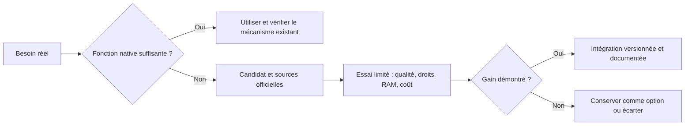

# Choisir les outils du bureau d'études

Un catalogue sert à découvrir des candidats. Leur popularité ne prouve ni leur adéquation à une petite VM ni la fiabilité de leurs promesses. Les mécanismes natifs et la compatibilité avec les données et permissions sont examinés avant d'ajouter un service.

## Premiers candidats examinés

| Outil | Apport possible | Décision initiale |
|---|---|---|
| [LintLang](https://github.com/hermes-labs-ai/lintlang) | Analyse statique locale des instructions et interfaces d'outils, sans appel de modèle | Prioritaire pour un essai dans la validation du socle ; ne remplace pas les essais fonctionnels |
| [Hermes Tool Slimmer](https://github.com/aliasocracy/hermes-tool-slimmer) | Sélection des schémas d'outils par mots-clés et recherche d'outils | Mesurer son bénéfice par rapport au chargement paresseux natif et vérifier les outils oubliés |
| [Hermes Local Knowledge](https://github.com/stepanov1975/hermes-local-knowledge) | Retrouver les skills, scripts, procédures et autres capacités locales | Candidat pour retrouver la bonne procédure ; vérifier périmètres d'indexation, licences et ressources |
| [Sibyl Memory](https://github.com/Sibyl-Labs/Sibyl-Memory) | Mémoire structurée SQLite et FTS5, avec adaptateur Hermes | Hors socle initial : le produit introduit aussi des tiers et mécanismes d'activation à évaluer |

Ces projets ont été consultés depuis leurs dépôts source le 4 octobre 2026. Aucun n'est annoncé comme installé par ce dépôt. La sélection finale dépend de mesures et d'un essai de compatibilité avec la version verrouillée du moteur.

LintLang indique notamment qu'il ne détecte pas les contradictions sémantiques générales entre deux instructions. Un résultat de lint doit être interprété selon les contrôles réellement effectués.

## Composants connus à réévaluer

Les décisions détaillées, les dépôts source, les licences et les critères d'acceptation sont dans [ECC, Context7, Headroom, RTK et zram](choix-modules.md). ECC sera repris par sélection de skills ; Context7 est prévu à la demande pour le développement. Headroom est différé et RTK reste candidat à un essai ciblé. Aucun des quatre n'est encore installé dans la v1. La zram est installée et son activation après redémarrage a été vérifiée ; son coût CPU et son comportement en charge restent à mesurer.

Les grands frameworks d'équipe, mémoires vectorielles et tableaux de contrôle supplémentaires restent des options. Leur ajout doit résoudre un problème identifié qui n'est pas déjà traité par le moteur et le harness.

## La règle d'entrée d'un nouvel outil

