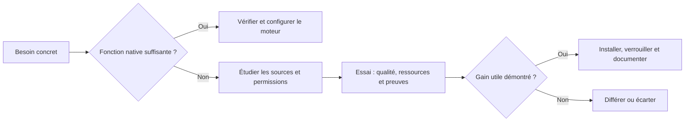

# Choisir les outils du bureau d'études

Le catalogue [Hermes Atlas](https://hermesatlas.com/lists/) aide à découvrir des candidats. Les décisions reposent sur leurs sources officielles et des essais dans la plateforme.

L'[étude de huit outils](etude-outils-v1.md) explique les intégrations retenues, les outils différés ou écartés, les mesures et les limites. ECC, Context7 et LintLang sont intégrés ; RTK est compilé, installé et testé pour Debian 12. Headroom, Tool Slimmer, Local Knowledge et Sibyl n'ajoutent pas de composant dans cette v1.

Chaque composant adopté est crédité dans [THIRD_PARTY_NOTICES.md](../THIRD_PARTY_NOTICES.md). Aucun outil n'est reconduit uniquement parce qu'il était présent dans l'alpha.
