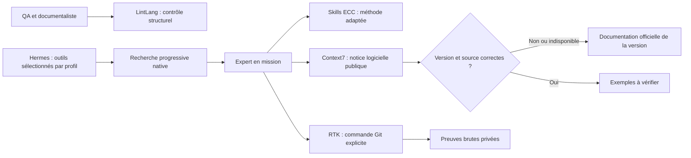

# Les outils retenus pour Alfred v1

Étude et essais du 4 octobre 2026, sur Debian 12 ARM64 avec 2 vCPU et 2 Go de RAM. Le choix privilégie un besoin concret, les fonctions natives, les droits effectifs, la qualité des preuves, puis le coût en contexte et en ressources. La popularité et les gains promotionnels ne servent pas de preuve.

## Synthèse des décisions

| Outil | Décision | Pourquoi | Mise en service |
|---|---|---|---|
| [ECC](https://github.com/affaan-m/ECC) | Retenu par sélection | Des méthodes utiles aux experts, sans importer un second harness ni une mémoire globale. | Trois skills adaptés et installés dans les profils experts : vérification, revue de sécurité, recherche progressive. Aucun chez Alfred. |
| [Context7](https://github.com/upstash/context7) | Retenu, à la demande | Documentation logicielle publique ciblée, sans serveur Node local. | MCP distant pour dev, devops et platform-engineer ; résolution et consultation versionnée vérifiées depuis Hermes. |
| [LintLang](https://github.com/hermes-labs-ai/lintlang) | Retenu | Contrôle local déterministe des structures d'instructions ; pas d'appel IA. | Version 0.8.2 dans un venv séparé, commande `alfred-lint`, skill QA/documentaliste et contrôle CI. |
| [RTK](https://github.com/rtk-ai/rtk) | Retenu pour des commandes Git explicites | Réduire certaines sorties Git, avec conservation locale des commandes brutes. | Version 0.51.0 compilée, installée et testée ; cinq profils disposent du skill dédié. |
| [Headroom](https://github.com/headroomlabs-ai/headroom) | Non retenu dans la v1 | La compression générale ajoute une intégration au chemin des modèles ; aucun gain mesuré ici ne justifie ce coût et le risque de perte de contexte. | Aucun proxy ni service installé. Réévaluation si les mesures de missions montrent un coût de contexte important. |
| [Hermes Tool Slimmer](https://github.com/aliasocracy/hermes-tool-slimmer) | Non retenu | La sélection par profil et la recherche progressive natives réduisent déjà les schémas tout en gardant les outils récupérables. | Utilisation du mécanisme natif, vérifié ; aucun plugin supplémentaire. |
| [Hermes Local Knowledge](https://github.com/stepanov1975/hermes-local-knowledge) | Différé | Catalogue de capacités intéressant lorsque les procédures deviennent nombreuses ; le petit catalogue actuel est déjà accessible par les skills natifs. | Aucun index supplémentaire. Ce catalogue de procédures ne remplace pas une recherche dans des PDF techniques. |
| [Sibyl Memory](https://github.com/Sibyl-Labs/Sibyl-Memory) | Non retenu dans la v1 | Une seconde mémoire ajoute migration, arbitrage des références et gouvernance sans besoin démontré. | Mémoires natives des profils et sources partagées conservées ; aucun adaptateur ajouté. |

La zram reste active et supervisée. Elle amortit certains pics de mémoire au prix de CPU ; sa taille logique n'ajoute pas de RAM physique.

## Dans le bureau d'Alfred

Ce schéma décrit l'accès aux outils ; le circuit complet de missions autonomes reste soumis à ses propres essais. Les profils partagent un compte Linux : leur répartition est logique et ne constitue pas une isolation système.

## ECC : reprendre la méthode utile

Les trois adaptations sont courtes, en français, avec une description de déclenchement explicite. LintLang a repéré l'absence de ce déclenchement dans leurs premiers en-têtes ; ils ont été corrigés. Les notices MIT et la révision source sont conservées avec les adaptations.

La vérification choisit les contrôles liés au changement et conserve les preuves ; elle n'impose ni couverture arbitraire de 80 %, ni répétition automatique de tests. La revue de sécurité porte sur les accès, secrets, entrées et dépendances réellement concernés. La recherche progressive limite les passes à trois et conserve provenance, version et incertitudes. Aucune méthode n'accorde de privilège supplémentaire. Les hooks, auto-apprentissage et Memory Vault complets d'ECC ne sont pas importés.

Un essai réel du profil QA avec ecc-verification a repéré un fichier Python fictif invalide, produit le SyntaxError attendu et limité le verdict à la syntaxe sans modifier le fichier. Leur effet sur la qualité d'une mission n'a pas encore fait l'objet d'un essai comparatif avec le même modèle : nous ne leur attribuons donc aucun pourcentage d'amélioration.

## Context7 : utile avec une règle de version

Le transport HTTP MCP distant fonctionne avec MCP 2.0 et le moteur Hermes verrouillé. Les deux outils `resolve-library-id` et `query-docs` sont les seuls exposés ; ressources et prompts du serveur sont exclus. L'accès anonyme a fonctionné durant l'essai. Une clé optionnelle pourra augmenter les limites ; aucune clé Context7 n'est requise ni ajoutée à Git dans ce déploiement.

L'essai Python illustre un piège réel : une requête mentionnant « Python 3.11 » sur `/python/cpython` a fourni des références à `main`. L'identifiant `/python/cpython/v3.11.14` a fourni des références portant ce tag. Le skill exige de vérifier ces références et de revenir à la documentation officielle si la version demandée manque. Ce contrôle de pertinence relève de la procédure de l'agent, pas d'un validateur automatique des réponses.

Le serveur n'annonce pas `readOnlyHint=true` pour ces recherches : le mode `untrusted` natif demandait alors une validation interactive, incompatible avec leur usage autonome. Le déploiement autorise explicitement ces deux opérations documentaires avec `trust: full` et une liste d'outils fermée. Cela n'accorde pas une confiance aux instructions contenues dans les réponses. Le serveur distant peut évoluer : son binaire n'est pas verrouillé par le commit d'étude.

Les recherches doivent rester génériques, sans noms de clients, pièces internes, configurations réelles ou secrets. Un endpoint local volontairement inaccessible a été détecté comme erreur ; la documentation officielle Python 3.11 a été accessible en repli. Le scénario complet de repli décidé par un modèle en mission n'est pas encore validé. `lazy: true` réutilise le cache de schémas ; une première découverte sans cache peut néanmoins établir une connexion.

## LintLang : un contrôle supplémentaire, avec limites

La version 0.8.2 et PyYAML 6.0.3 sont installées depuis des wheels à empreintes vérifiées. Le venv reste distinct de celui d'Hermes. Le contrôle examine explicitement AGENTS, SOUL et SKILL ; il ne scanne ni mémoires réelles ni credentials. Les constats high/critical bloquent la CI ; les avis medium sont à relire. Les entrées non inspectées ne doivent pas être présentées comme validées. Aucune correction automatique ni baseline de masquage n'est appliquée.

Les quatorze fichiers d'instructions publics examinés après correction ont obtenu PASS, sans entrée SKIPPED. La confiance heuristique HERM est basse pour plusieurs textes français : ce score n'est ni une probabilité de justesse ni la détection de toutes les contradictions. LintLang complète la revue et les tests fonctionnels ; il ne les remplace pas. Les nouveaux fichiers ajoutés sont également soumis à la CI.

## Tool Slimmer : le gain natif suffit actuellement

Deux erreurs de configuration ont été corrigées : le moteur lit `agent.disabled_toolsets` et `platform_toolsets.<canal>`, pas les anciennes clés au premier niveau. Les outils de délégation récursive et d'exécution de code sont désormais réellement absents du catalogue examiné. Des limites de profondeur à zéro ne suffisaient pas à les désactiver.

Pour les profils experts, les schémas Kanban et certains outils peu fréquents sont exposés par `tool_search`, `tool_describe` et `tool_call`. Sur le profil de développement avec Context7, le catalogue brut comptait 29 outils et 52 356 caractères ; la représentation native envoyée au modèle en comptait 14 et 24 713 caractères, soit **52,8 % de caractères en moins**. La recherche de `kanban_create`, `kanban_complete` et `process_manage` a réussi. Le petit catalogue de l'interface reste directement exposé, sans pont supplémentaire.

Cette mesure ne représente pas les tokens facturés, le coût total d'une mission ou tous les profils. Tool Slimmer utilise une sélection locale par mots-clés : ce mécanisme pourrait être utile sur un gros catalogue futur, mais ajouter un second sélecteur aujourd'hui multiplie les possibilités d'omission sans gain propre démontré.

## RTK : utile sur des lectures Git verbeuses

Le binaire ARM64 GNU publié de 0.51.0 échoue sur Debian 12 car il demande glibc 2.39. La même version a été compilée depuis son commit verrouillé avec Rust 1.91.0, un job, LTO désactivé et limites de ressources. Le build a terminé en environ vingt minutes. Ce coût est ponctuel ; aucun processus RTK ne reste résident.

L'intégration expose seulement une commande explicite pour `git status`, `log`, `diff` et `show`. Elle ne réécrit pas le terminal. Un intercepteur local transparent capture les sorties et codes de chaque invocation Git faite par RTK ; ces preuves restent privées, lisibles par l'expert, hors Git. La télémétrie et le suivi de gains internes à RTK sont désactivés.

| Essai sur un dépôt fictif contrôlé | Sortie brute | Résumé avec chemin des preuves | Code | Résultat |
|---|---:|---:|---:|---|
| Status de 30 fichiers modifiés | 1 088 octets | 665 octets | 0 | Réduction de 38,9 % |
| Diff de plusieurs fichiers, 27 Ko | 27 237 octets | 8 324 octets | 0 | Réduction de 69,4 % |
| Status hors dépôt | 69 octets | 137 octets | 128 | Échec conservé ; indication de preuve ajoute du texte |
| Diff avec erreur d'espacement, `--check` | 62 octets | 178 octets | 2 | Échec et diagnostic conservés |

Toutes les sorties capturées ont été comparées octet par octet à une réexécution des commandes internes dans ce dépôt stable. Les deux échecs gardent leur code. Les chemins de preuve peuvent faire grossir une sortie courte : réserver RTK aux lectures verbeuses. Ces fixtures ne mesurent ni l'économie en tokens facturés ni la qualité de missions réelles. Un expert doit consulter le diff intégral pour une revue exigeant la preuve complète.

## Pourquoi ne pas ajouter les autres modules ?

**Headroom** propose une bibliothèque, des proxys et d'autres modes qui n'ont pas tous les mêmes dépendances. Les fonctions ML avancées sont optionnelles : prétendre que tous les modes exigent un gros modèle local serait inexact. La décision actuelle repose sur l'absence de gain mesuré sur nos missions et sur le coût d'une intégration au routage et aux preuves. Réexaminer sur les mêmes missions, modèle et données, avec qualité, latence, ressources et tokens réellement relevés.

**Local Knowledge** indexe surtout des capacités locales — skills, scripts, procédures — et peut aider à retrouver le bon outil. La recherche lexicale dans un corpus PDF est un autre besoin, porté par une expertise. Réexaminer ce catalogue lorsque la recherche native de skills devient insuffisante, avec indexation limitée aux sources appropriées.

**Sibyl Memory** dispose d'un mode local SQLite/FTS sans compte obligatoire ; son mode non activé n'envoie pas automatiquement le contenu des mémoires. Certaines fonctions activées ajoutent des vérifications de capacité et des niveaux de service. Le rejet initial vient de la duplication du système de mémoire et de sa gouvernance, pas d'une accusation d'exfiltration automatique.

## Versions, crédits et reconstruction

Les composants adoptés et les sources étudiées sont reliés au [verrou des modules](../config/modules.lock.json) et aux [crédits](../THIRD_PARTY_NOTICES.md). Les scripts et procédures sont dans le [guide de déploiement des modules](deploiement-modules.md). Les sources d'une personnalisation documentaire restent dans son dépôt privé ; les corpus et preuves opérationnelles restent hors du socle public.

L'étude ne certifie pas la plateforme complète : livraison réelle sur tous les canaux, publication automatique des deux dépôts, sauvegarde chiffrée des données et reconstruction intégrale restent des validations distinctes.
