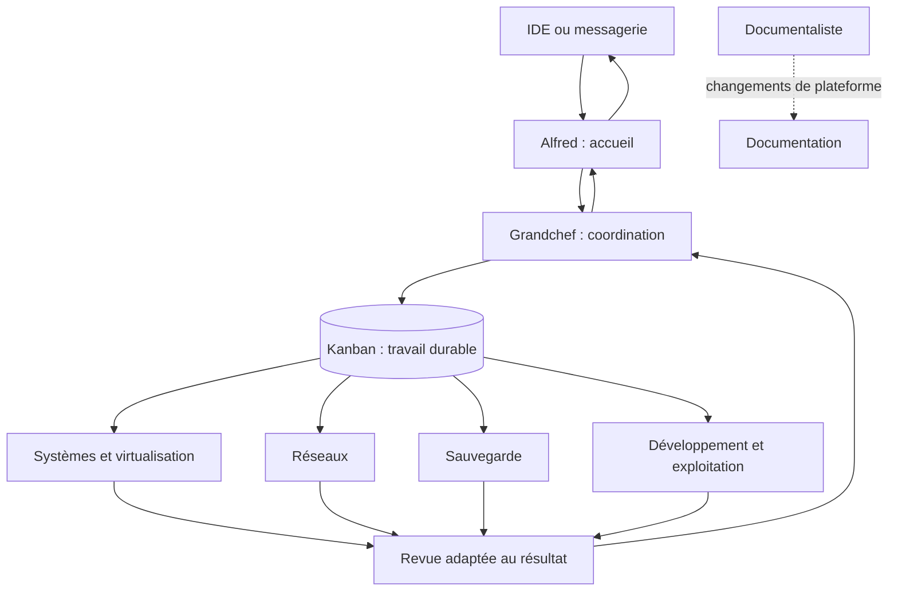
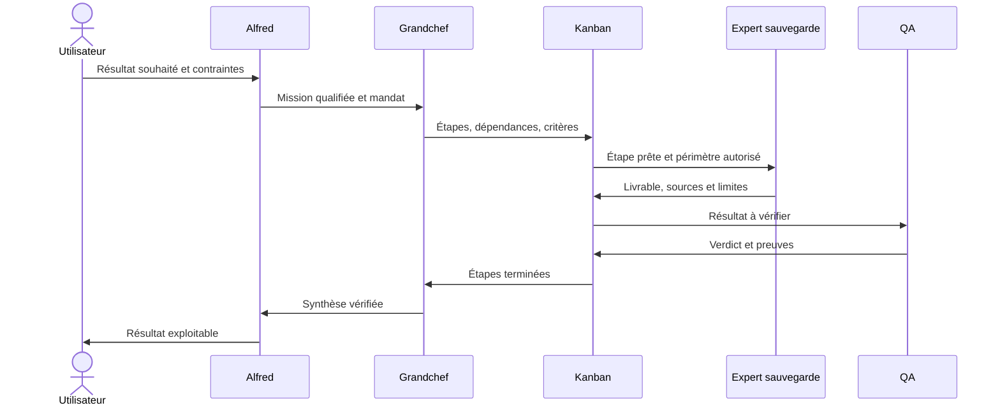
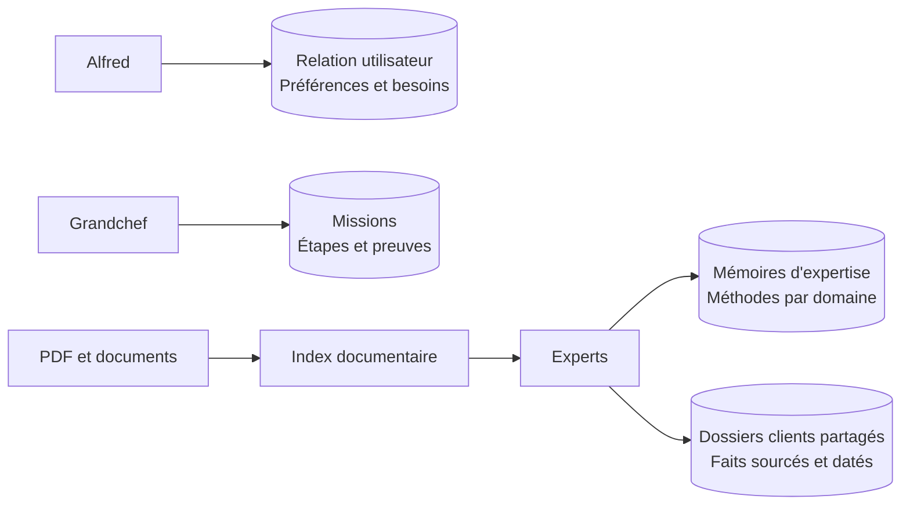
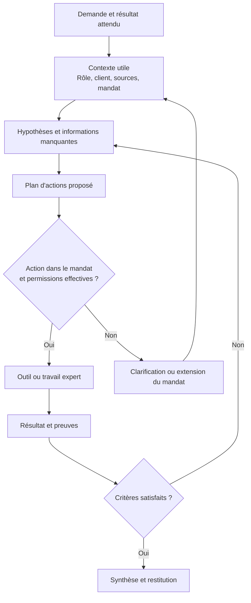
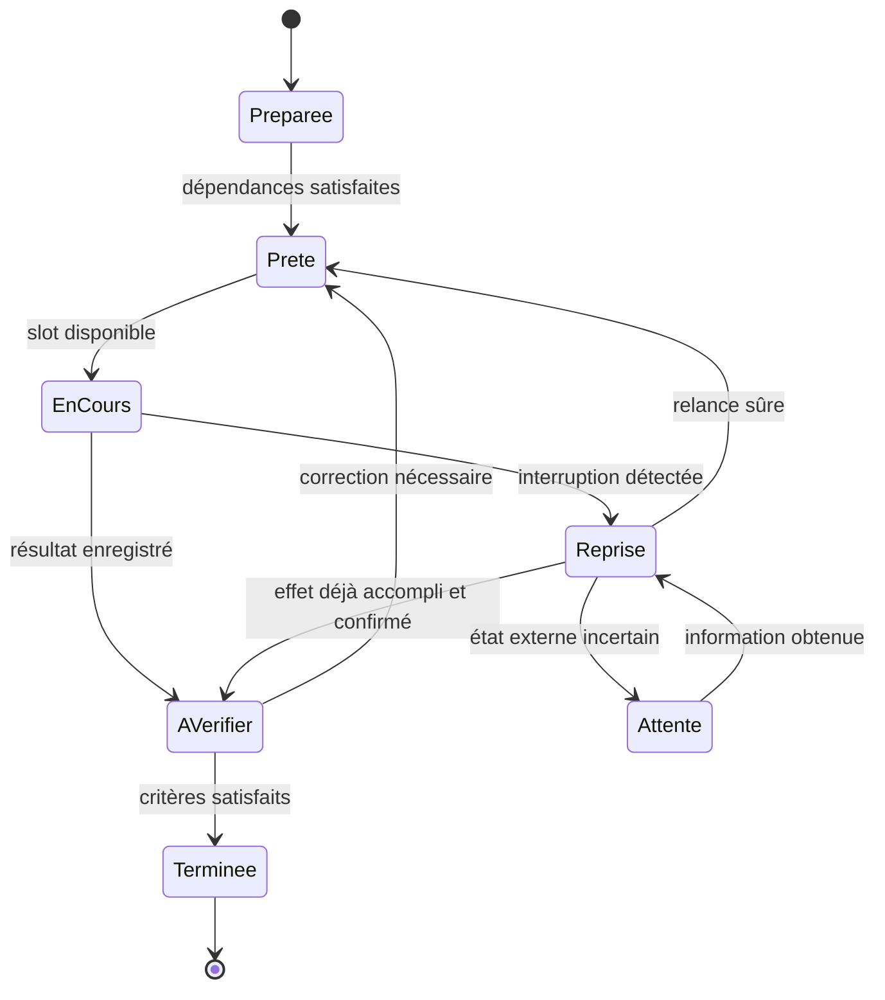

# Le bureau d'études d'Alfred

Ce guide décrit **la cible v1**, pas des fonctions déjà toutes déployées. Imagine un bureau d'études : une réception, un chef de projet, des spécialistes et un tableau de suivi. Le tableau garde les engagements ; les spécialistes ne restent pas tous devant leur bureau lorsqu'il n'y a rien à faire.

## Une porte d'entrée, plusieurs mains

**Alfred** connaît son utilisateur et reformule son besoin. Il garde la relation et livre le résultat. **Grandchef** organise la mission : étapes, compétences, dépendances et critères d'acceptation. Les **experts** connaissent leurs domaines. **QA** examine les preuves de qualité ; **RSSI** examine les risques lorsqu'ils le nécessitent. Le **documentaliste** explique les changements de la plateforme.

Une SOUL définit l'identité, le rôle et la façon de travailler d'un agent. Sa mémoire conserve des faits et méthodes utiles. Ce sont deux choses différentes : une instruction de rôle ne constitue pas une preuve sur un client.

Un profil peut exister sans avoir un processus actif. Le scheduler ouvre les postes de travail nécessaires, dans une limite globale. Une configuration initiale de deux travaux simultanés et d'un travail par profil sert de point de départ pour une petite VM ; les mesures déterminent les plafonds adaptés.

## Un exemple concret

Demande fictive : « Compare deux stratégies de sauvegarde pour le client Démo et prépare une recommandation. »

Alfred comprend le résultat attendu et les contraintes utiles. Grandchef distingue les informations à réunir, l'analyse de sauvegarde, les éventuels points réseau et la vérification. Les experts consultent le même dossier Démo. La revue vérifie les arguments et les sources. Alfred présente le résultat et les incertitudes qui restent pertinentes pour son utilisateur.

Le retour d'un expert ne suffit pas à déclarer la mission terminée. Il faut satisfaire ses critères et conserver les preuves utiles. Une étape qui attend une autre libère sa place au lieu de garder un agent actif sans travail.

## Où vit la connaissance ?

L'analogie est celle de trois classeurs : « mon utilisateur », « mon métier » et « nos clients ». Copier tout dans le premier rendrait l'assistant moins clair et multiplierait les contradictions.

Un fait client porte une source, une date et un état : observation, hypothèse, vérifié ou périmé. Un expert peut ainsi distinguer une topologie constatée hier d'une hypothèse ancienne.

L'index documentaire aide à retrouver un passage utile. Il ne transforme pas un PDF en connaissance certaine du modèle et ne remplace pas une vérification. La référence, la version et le contexte du passage restent nécessaires.

## Comment une décision se construit-elle ?

Le harness prépare le contexte et encadre les outils. Le modèle propose un plan ou une action. L'exécution fournit un résultat. La vérification décide s'il faut continuer, corriger ou consulter l'utilisateur.

On documente les hypothèses retenues, les décisions, les sources, les appels d'outils et les vérifications. Ces traces expliquent le travail observable ; elles ne prétendent pas être une transcription exacte du fonctionnement interne du modèle.

Une SOUL qui demande de respecter les permissions ne crée pas ces permissions. L'accès aux fichiers, au coffre et aux opérations externes doit être imposé par le logiciel. Une identité de profil ne constitue pas, à elle seule, une isolation de sécurité.

## Et si la VM s'arrête au milieu ?

Le tableau conserve les étapes et leurs résultats. Au redémarrage, on examine les opérations réellement effectuées avant de relancer. Un fichier déjà créé ou un changement externe déjà appliqué ne doit pas être reproduit aveuglément.

La machine à états ci-dessus est un schéma logique de la cible. Ses libellés ne sont pas une liste contractuelle des statuts internes du moteur.

## Comment la documentation reste-t-elle à jour ?

Le logiciel repère un changement de configuration, rôle ou skill, conserve son diff et prépare les validations. Le documentaliste explique ce qui change. Les contrôles comparent le texte aux paramètres vérifiables. Les commits et les erreurs de publication sont suivis explicitement.

Le contexte du documentaliste public contient uniquement les éléments publics. La personnalisation et la documentation d'une instance privée suivent un circuit distinct. Une tâche métier ordinaire n'est pas un changement du produit.
