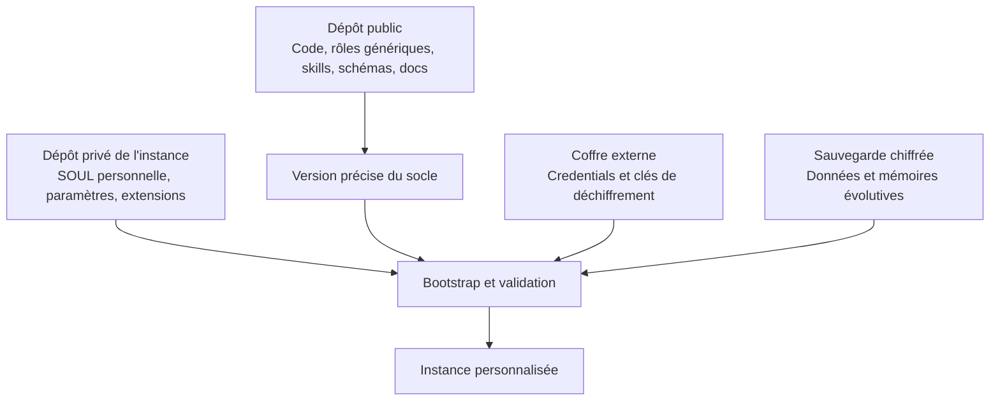

# Un socle commun, une instance à soi

Le socle fournit les outils du bureau d'études. L'instance définit pour qui il travaille, avec quels accès, quelles contraintes et quelle équipe.

Le dépôt d'instance référence une révision immuable du socle. Les mises à jour sont choisies et testées. Elles ne remplacent pas la personnalisation par les valeurs par défaut.

| Socle public | Instance privée | Coffre / sauvegarde |
|---|---|---|
| SOUL génériques | SOUL de son Alfred et adaptations | Mémoires opérationnelles sauvegardées |
| Adaptateurs et schémas | Routes et options non secrètes | Tokens et credentials |
| Règles générales d'orchestration | Composition de l'équipe et limites | État des missions |
| Documentation du produit | Documentation de son installation | Pièces et faits clients sauvegardés |

Un dépôt privé ne dispense pas d'exclure les secrets. Un nom de variable ou une référence de coffre peut être versionné ; une clé API ou un mot de passe ne le peut pas.

Le socle doit permettre une installation neuve sans identité préexistante. Chaque nouvel utilisateur fournit ses préférences et connecte ses comptes. Aucun dossier utilisateur ou client réel ne fait partie des exemples publics.

Reconstruction complète signifie : reconstruire les composants depuis les dépôts, rétablir les accès via le coffre et récupérer l'état depuis les sauvegardes choisies. Le dépôt ne peut pas recréer un credential révoqué ou des données qui n'ont jamais été sauvegardées.
