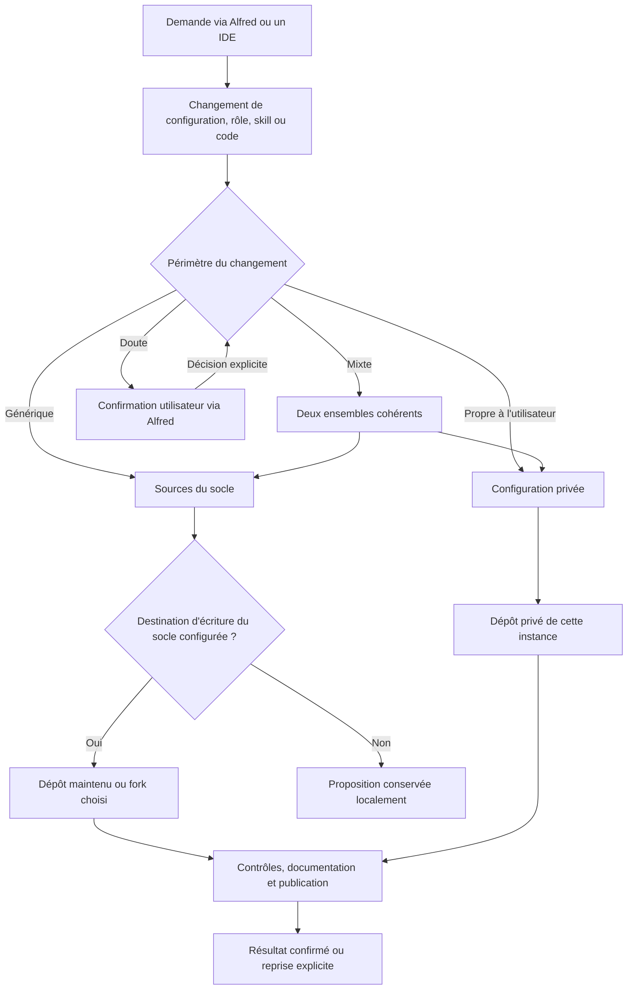

# Qui met à jour quel dépôt ?

Chaque installation choisit ses destinations GitHub dans sa configuration privée. Le socle ne fournit ni accès d'écriture au dépôt d'origine ni credential partagé entre utilisateurs.

## Propriétaire d'instance et mainteneur du socle

Le mode `instance_owner` lit le socle public et publie la personnalisation dans le dépôt privé de l'utilisateur. Sa destination d'écriture du socle est `null`. Un utilisateur peut ajouter un fork qu'il possède, avec un accès propre à ce fork.

Le mode `platform_maintainer` configure en plus une destination autorisée pour publier les changements génériques du socle. Le mode déclaré n'accorde aucun droit GitHub : le service doit vérifier que son credential possède effectivement le droit d'écriture sur cette destination.

Une adaptation faite pour un utilisateur va par défaut dans ses points de personnalisation privés. Le service ne déduit jamais qu'un contenu peut devenir public simplement parce qu'un agent le trouve utile. Une amélioration générique doit être préparée dans les sources publiques avec des exemples fictifs. Sans destination d'écriture du socle, elle reste une proposition locale ; un utilisateur qui veut maintenir sa variante peut choisir son propre fork.

L'[exemple de publication](../examples/publication.example.json) contient uniquement des destinations fictives pour l'instance et des références de credentials. Chaque utilisateur remplace les références par les accès qu'il autorise dans son propre coffre.

## Le documentaliste publie via un broker contrôlé

Les demandes arrivent aussi bien par Alfred que par un IDE ou un opérateur autorisé. Le documentaliste examine l'effet du changement, et pas l'identité de son auteur, pour proposer la destination. Un chemin de fichier est un indice de périmètre ; il ne prouve pas qu'un texte contenant des données privées puisse être rendu public.

| Classe | Critère | Traitement |
|---|---|---|
| Socle | Comportement réutilisable, mécanisme générique, correction ou skill indépendant d'une personne et de ses données | Sources publiques et documentation générique, avec exemples fictifs |
| Instance | Personnalité, préférence, budget, choix de modèle, connexion, extension ou réglage propre à l'utilisateur | Sources et documentation de son instance privée |
| Mixte | Une évolution du mécanisme commun nécessite aussi des paramètres propres à l'instance | Deux ensembles séparés et versions liées ; aucune copie brute du contexte privé vers la rédaction publique |
| Indéterminé | Effet ou périmètre ambigu, information privée potentiellement exposée | Diff conservé ; confirmation explicite via Alfred avant publication |

Exemple : rendre le routage des modèles configurable concerne le socle ; choisir le modèle et le plafond d'un utilisateur concerne son instance. Une nouvelle fonction avec ses paramètres d'instance concerne les deux. Les tâches, sessions, connaissances clients et mémoires évolutives sont des données opérationnelles, pas des changements à publier par ce circuit.

Le documentaliste propose et explique la classification. Les contrôles logiciels vérifient les périmètres de fichiers, les accès, les secrets et la destination ; ils ne déduisent pas à eux seuls la confidentialité de toute phrase. Une classification incertaine ne devient pas une autorisation par défaut. La même procédure s'applique pendant la construction depuis un PC et lorsque les demandes arrivent à Alfred sur la VM.

Le broker de publication reçoit un ensemble de fichiers explicitement classés et une destination autorisée. Il conserve un diff stable, vérifie les sources et la documentation, recherche les credentials et crée un commit. Le résultat de push est confirmé auprès du dépôt distant avant de déclarer le travail terminé.

Chaque destination utilise un accès limité au dépôt concerné. Les agents ordinaires n'ont pas de credential permettant de publier arbitrairement sur le compte GitHub. Le contexte de rédaction publique reste limité aux sources publiques, tandis que la rédaction privée traite les paramètres autorisés de l'instance.

Pour une intégration durable, la cible est une GitHub App installée uniquement sur les dépôts autorisés, avec des jetons d'installation restreints à chaque destination. Un token personnel à permissions fines et limité à un dépôt peut servir d'alternative pour une installation individuelle. Les références d'accès sont dans la configuration ; les clés et jetons restent dans le coffre. Voir la documentation officielle sur les [GitHub Apps](https://docs.github.com/en/apps/creating-github-apps/about-creating-github-apps/about-creating-github-apps) et les [tokens à permissions fines](https://docs.github.com/en/authentication/keeping-your-account-and-data-secure/managing-your-personal-access-tokens).

Le mécanisme regroupe les écritures d'un même changement et conserve les publications en attente. Un conflit distant est traité par une reprise contrôlée ; le service ne force pas l'historique pour effacer les changements d'un autre contributeur.

GitHub ne fournit pas de transaction unique entre les deux dépôts. Lorsqu'un changement concerne les deux, le service publie et valide d'abord le commit du socle, puis inscrit ce SHA dans `platform.lock.json` avant de publier l'instance. Si la seconde publication échoue, elle reste en attente ; le service ne déclare pas la paire synchronisée. Le manifeste de déploiement conserve les deux commits réellement appliqués sur la VM, même si une publication reste à reprendre.

La mise à jour d'une tâche, d'une session ou d'une mémoire opérationnelle suit son propre stockage et ses sauvegardes. Elle ne déclenche pas automatiquement un changement du produit.

## État de mise en place

Le broker privilégié, les workspaces de sources et le skill de maintenance sont implémentés et opérationnels. Le documentaliste lui transmet une liste explicite de fichiers et reçoit une confirmation distante. Le déclenchement vient de la mission Kanban et de ses consignes ; il n’existe pas encore de détection automatique de toute dérive hors mission. Une publication réussie ne certifie pas tous les workflows ni une reconstruction complète.

La reprise du contexte professionnel sans les préférences exclues est effective. Les sources sont accessibles à Alfred. Les scopes sont corrigés par D-Bus (manager utilisateur pour les scopes workers) et le bus est exposé à la gateway malgré ProtectHome. La publication s'effectue via le broker contrôlé.

## Installer et utiliser le broker

Installer les scopes workers avec `sudo python3 bootstrap/install-workers.py`, puis le broker avec `sudo python3 bootstrap/install-publication.py --instance-source /chemin/instance --credential-file /chemin/root/credential.json`. Le fichier credential contient un objet avec une clé token, reste root:root 0600, hors Git. Une seconde référence `--platform-credential-file` permet des accès distincts. Les destinations proviennent de publication.json de l’instance, jamais d’une requête agent. Une installation sans destination d’écriture du socle ne peut pas publier vers celui-ci.

Gitleaks ARM64 est verrouillé par version et SHA256 dans publication-dependencies.lock.json. Le broker conserve ses clones root sous /var/lib/alfred/publication ; les agents ne reçoivent que les sources dans shared/repositories/platform et shared/repositories/instance. Les hooks sont désactivés ; les configs Git des workspaces agents ne sont pas utilisés. Aucun token n’est renvoyé par les actions status, sync, publish ou retry.

Alfred consulte le contexte et les sources pour qualifier la demande, puis transmet à Orchestrator. Platform Engineer réalise les changements de fonctionnement ; le documentaliste documente, classe et publie, sous le mandat permanent. Les revues QA/RSSI sont choisies selon le besoin. Une tâche ordinaire n’ajoute ni documentaire produit ni publication de données métier.

Le broker refuse chemins de secrets, données opérationnelles, symlinks, sources trop grosses, erreurs de syntaxe, secrets détectés et base Git obsolète. Il ne sait pas classifier le sens de toute information personnelle : le documentaliste doit contrôler les contextes public/privé et demander l’arbitrage en cas de doute. Les agents partagent encore un compte Unix : ces profils ne constituent pas une isolation de sécurité.

Une erreur de push conserve le commit. retry ne publie que si la branche distante est ancêtre du commit local ; une divergence ne déclenche jamais de force-push. Les deux dépôts se publient successivement, et le verrou privé doit pointer le commit public confirmé. Les journaux de publication restent privés, hors Git.
