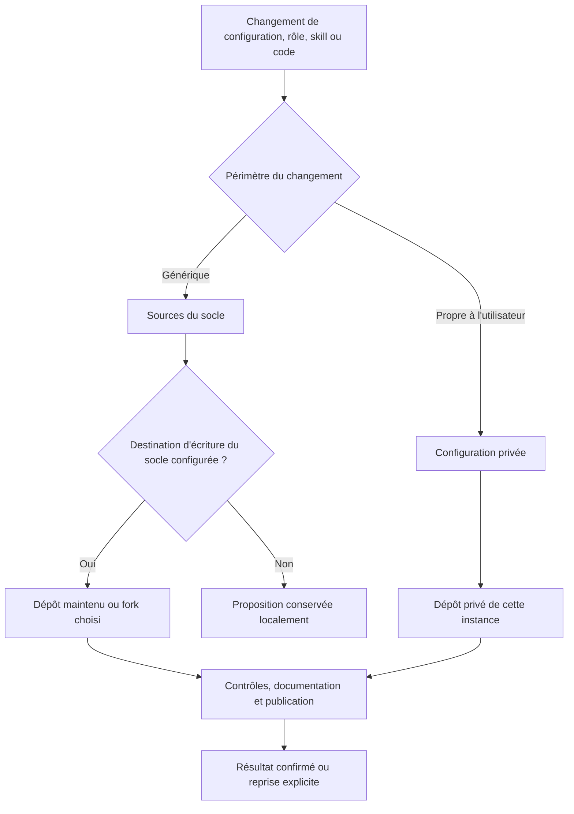

# Qui met à jour quel dépôt ?

Chaque installation choisit ses destinations GitHub dans sa configuration privée. Le socle ne fournit ni accès d'écriture au dépôt d'origine ni credential partagé entre utilisateurs.

## Propriétaire d'instance et mainteneur du socle

Le mode `instance_owner` lit le socle public et publie la personnalisation dans le dépôt privé de l'utilisateur. Sa destination d'écriture du socle est `null`. Un utilisateur peut ajouter un fork qu'il possède, avec un accès propre à ce fork.

Le mode `platform_maintainer` configure en plus une destination autorisée pour publier les changements génériques du socle. Le mode déclaré n'accorde aucun droit GitHub : le service doit vérifier que son credential possède effectivement le droit d'écriture sur cette destination.

Une adaptation faite pour un utilisateur va par défaut dans ses points de personnalisation privés. Le service ne déduit jamais qu'un contenu peut devenir public simplement parce qu'un agent le trouve utile. Une amélioration générique doit être préparée dans les sources publiques avec des exemples fictifs. Sans destination d'écriture du socle, elle reste une proposition locale ; un utilisateur qui veut maintenir sa variante peut choisir son propre fork.

L'[exemple de publication](../examples/publication.example.json) contient uniquement des destinations fictives pour l'instance et des références de credentials. Chaque utilisateur remplace les références par les accès qu'il autorise dans son propre coffre.

## Un service qui publie, des agents qui préparent

Le futur service de publication reçoit un ensemble de fichiers explicitement classés et une destination autorisée. Il conserve un diff stable, vérifie les sources et la documentation, recherche les credentials et crée un commit. Le résultat de push est confirmé auprès du dépôt distant avant de déclarer le travail terminé.

Chaque destination utilise un accès limité au dépôt concerné. Les agents ordinaires n'ont pas de credential permettant de publier arbitrairement sur le compte GitHub. Le contexte de rédaction publique reste limité aux sources publiques, tandis que la rédaction privée traite les paramètres autorisés de l'instance.

Pour une intégration durable, la cible est une GitHub App installée uniquement sur les dépôts autorisés, avec des jetons d'installation restreints à chaque destination. Un token personnel à permissions fines et limité à un dépôt peut servir d'alternative pour une installation individuelle. Les références d'accès sont dans la configuration ; les clés et jetons restent dans le coffre. Voir la documentation officielle sur les [GitHub Apps](https://docs.github.com/en/apps/creating-github-apps/about-creating-github-apps/about-creating-github-apps) et les [tokens à permissions fines](https://docs.github.com/en/authentication/keeping-your-account-and-data-secure/managing-your-personal-access-tokens).

Le mécanisme regroupe les écritures d'un même changement et conserve les publications en attente. Un conflit distant est traité par une reprise contrôlée ; le service ne force pas l'historique pour effacer les changements d'un autre contributeur.

GitHub ne fournit pas de transaction unique entre les deux dépôts. Lorsqu'un changement concerne les deux, le service publie et valide d'abord le commit du socle, puis inscrit ce SHA dans `platform.lock.json` avant de publier l'instance. Si la seconde publication échoue, elle reste en attente ; le service ne déclare pas la paire synchronisée. Le manifeste de déploiement conserve les deux commits réellement appliqués sur la VM, même si une publication reste à reprendre.

La mise à jour d'une tâche, d'une session ou d'une mémoire opérationnelle suit son propre stockage et ses sauvegardes. Elle ne déclenche pas automatiquement un changement du produit.

## État de mise en place

Les fichiers d'exemple et le contrat de routage existent. Le service automatique, ses accès limités, la file de reprise et les essais de permissions restent à implémenter et tester. Une publication manuelle réussie ne démontre pas encore ce circuit autonome.
