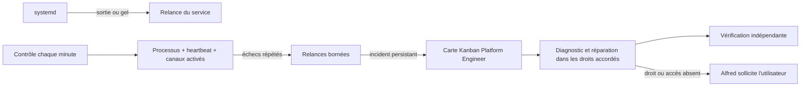

# Qui veille sur Alfred ?

La relance d'un processus ne dépend pas d'un modèle IA. `systemd` garde la gateway en fonctionnement et la lance au démarrage de la VM. Si elle sort, il la relance après 15 secondes, avec au plus cinq démarrages sur quinze minutes. Une limite de ressources commune couvre la gateway, ses enfants et le diagnostic de secours.

Hermes envoie son signal de vie à systemd uniquement si sa boucle interne progresse. Le watchdog est configuré à 120 secondes. Un processus encore présent mais bloqué peut ainsi être arrêté puis relancé. `KillMode=control-group` nettoie aussi ses enfants, dont le bridge WhatsApp.

Le contrôle utilise l'inventaire détenu par root : `/etc/alfred/service-inventory.json`. Il vérifie la gateway, son heartbeat, les canaux configurés, zram, le timer et le résultat du diagnostic de secours. Le bridge WhatsApp doit annoncer `connected` ; Teams doit écouter sur son port local. Ces contrôles techniques ne certifient pas la livraison d'un message utilisateur. Un nouveau service permanent doit être ajouté à cet inventaire avant sa mise en service.

Après trois contrôles négatifs, le superviseur peut demander une relance, avec au plus deux demandes par heure et par service. Trois relances natives sur une heure créent également un incident, même si le service répond au moment du contrôle. Le démarrage dispose d'un délai de grâce. En fonctionnement sain, aucune inférence n'est lancée par cette surveillance.

Un incident persistant ouvre une carte idempotente pour `platform-engineer`, avec les contrôles et tentatives dans un dossier de mission. Si la gateway ne répond plus, une unité de secours indépendante lance ce profil pour un diagnostic limité à quatre minutes. Plusieurs incidents ouverts sont regroupés. Une panne du fournisseur de modèle laisse les preuves et la carte sur disque ; elle ne peut pas être réparée magiquement par une IA sans fournisseur disponible.

Le réparateur peut demander une relance via `/usr/local/bin/alfred-repair restart UNIT`. Une liste de commandes exacte et le plafond du superviseur encadrent ce droit. Cela ne lui donne ni un shell root, ni le droit de modifier les unités ou les secrets. Une modification durable passe par le circuit de documentation et de publication ; un besoin hors droits doit être bloqué et expliqué à Alfred.

Les MCP démarrés à la demande restent des enfants du moteur : ils ne deviennent pas chacun un service surveillé en permanence. Les téléchargements et ingestions sont des travaux bornés dont on vérifie le résultat et l'état de reprise. Un proxy optionnel tel que Headroom doit recevoir sa propre unité et ses probes si une instance l'adopte ; sa présence n'est pas supposée.

Installer après le moteur, les profils et les canaux : `sudo bash bootstrap/install-supervision.sh /chemin/du/socle`. Le bootstrap compose les probes des canaux activés et n'insère aucune identité ou credential dans l'inventaire. La gateway commune utilise le profil hôte `default` ; les messages sont routés vers le profil d'interface de l'instance.

Contrôles utiles : `systemctl status alfred-gateway.service alfred-monitor.timer`, `systemctl show alfred-gateway.service -p NRestarts -p Result`, puis `/var/lib/alfred/monitor/health.json`. Les incidents contiennent des données opérationnelles privées et restent hors Git.

L'agent ne garantit pas une correction automatique de toute panne : il diagnostique, répare dans les droits disponibles, vérifie, puis escalade le besoin précis si nécessaire. Les essais de panne et leurs résultats appartiennent au journal d'acceptation de chaque instance.

Le job déterministe de contrôle possède aussi Restart=on-failure et une limite de tentatives. La sonde du timer vérifie la fraîcheur de health.json : un timer actif avec des contrôles qui ne produisent plus de rapport n’est pas considéré comme sain.

## Ajouter un service de socle ou d’instance

Des fragments root-owned `/etc/alfred/service-inventory.d/*.json`, de forme `{"services": [...]}`, complètent l’inventaire principal. Une unité ne peut pas être déclarée deux fois : un fragment ne remplace jamais silencieusement une sonde du socle. Les extensions restent présentes lorsqu’un bootstrap régénère l’inventaire principal. Un service temporaire normalement inactif doit être suivi par son contrôleur de cycle de vie ; inscrire son contrôle permanent, plutôt que relancer aveuglément le travail temporaire. Le backend Desktop fournit son propre fragment et sa sonde HTTP.
